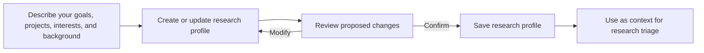
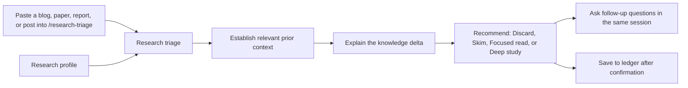

<h1 align="center">omp-knowledge-delta</h1>

<p align="center">
A profile-aware research triage extension for Oh My Pi
</p>

---

## Motivation

I keep finding papers, blog posts, and social-media discussions that I want to read. Instead of reading them, I save them for later and slowly build an overwhelming backlog.

The problem is that not everything deserves the same amount of attention. Some sources are directly relevant to current work, some only need a quick skim, and many can be safely ignored.

`omp-knowledge-delta` is meant to help make that decision quickly. It uses my current goals and background to establish the relevant prior context, identify what is genuinely new in a source, and recommend how much attention it deserves.

> **Note:** This is AI-generated code, and I have not reviewed the code in detail. This is primarily a utility I made for myself, so I did not spend much time on code quality; I mainly wanted a working thing.

## What This Repo Is About

The extension currently provides:

- [x] A user-controlled research profile
- [x] Profile updates with confirmation before writing
- [x] Triage for URLs and pasted claims
- [x] Prior-context and knowledge-delta analysis
- [x] Human-readable attention recommendations
- [x] Confirmed saving to a local research ledger

The goal is not to summarize and save more material. The goal is to reduce information overload and make research reading deliberate.

## Quick Start

Start OMP with the extension loaded:

```bash
cd /home/sodakey/omp-knowledge-delta
omp --extension ./src/index.js
```

### 1. Create your research profile

Run:

```text
/research-profile
```

Then describe yourself naturally. For example:

```text
I am working on retrieval evaluation. I understand transformers well, but
I am less familiar with benchmarking methodology. I care more about practical
and reproducible results than leaderboard improvements.
```

The model extracts the useful context, asks only necessary follow-up questions, shows the proposed changes, and saves them only after confirmation.

### 2. Triage something you found

For a URL:

```text
/research-triage https://example.com/paper
```

For a post, claim, or excerpt:

```text
/research-triage
```

Then paste the text.

The result explains:

- the relevant prior state;
- what the source claims;
- what its evidence supports;
- the knowledge delta;
- limitations and uncertainty;
- how much attention the source deserves.

The attention recommendation uses plain language:

```text
Discard
Skim
Focused read
Deep study
```

### 3. Continue the discussion normally

After triage, follow-up questions are ordinary messages. You do not need to repeat `/research-triage`:

```text
Why does this deserve a focused read?
Compare it with the strongest previous baseline.
What should I read first?
```

The original source and triage analysis remain in the same OMP session context. Use `/research-triage` again only when starting with a new source.

### 4. Save only what you choose to keep

After reviewing a result, say:

```text
Save this to the research ledger.
```

The extension previews the entry and asks for confirmation. Nothing is saved automatically after triage.

## Command Reference

| Command | Purpose |
| --- | --- |
| `/research-profile` | Create or update the profile through free-form input |
| `/research-profile update <text>` | Propose a profile update |
| `/research-profile show` | Display the current profile |
| `/research-profile delete` | Delete the profile after confirmation |
| `/research-triage <URL or text>` | Triage a paper, blog, post, or claim |

## Local Data

User data is stored outside this repository:

```text
~/.omp/agent/knowledge-delta/research-profile.md
~/.omp/agent/knowledge-delta/research-ledger.md
```

Set `PI_CODING_AGENT_DIR` to use another OMP agent directory. Profile updates and ledger writes are atomic, and existing files receive a local `.bak` backup before replacement.

The repository does not contain personal profile or ledger data.

## How It Works

### Research profile

Your profile acts as context for future research triage:



### Research triage

Give the extension a blog post, paper, technical report, or social-media
claim. It uses your profile to explain what is already known, what is new,
and how much attention the source deserves:



## Add to OMP

Clone the repository:

```bash
git clone https://github.com/Saad1926Q/omp-knowledge-delta.git
```

Load it for one session:

```bash
omp --extension /path/to/omp-knowledge-delta
```

To load it automatically, add the repository path to
`~/.omp/agent/config.yml`:

```yaml
extensions:
  - /path/to/omp-knowledge-delta
```

Restart OMP after changing the configuration. The extension registers the
`/research-profile` and `/research-triage` commands automatically.

## Development

Run the tests with:

```bash
npm test
```
